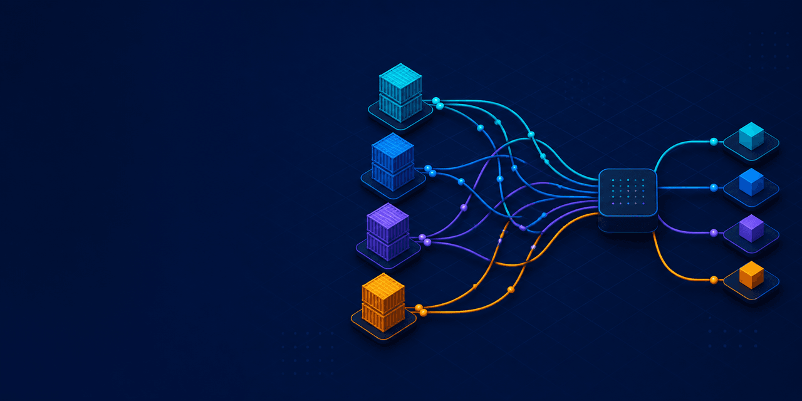

# Local Docker Port Resolver

**Stop local Docker port conflicts before they stop your stack.**

[](https://github.com/1ntekhab/local-docker-port-resolver/releases/latest)
[](LICENSE)
[](https://agentskills.io)
[](https://github.com/1ntekhab/local-docker-port-resolver/stargazers)

A portable [Agent Skill](https://agentskills.io) that teaches coding agents to prevent host-port collisions across local Docker Compose projects—without changing internal container ports.



It inspects every enabled published service, selects available host ports without changing container ports, synchronizes public URLs and trusted origins, preserves optional profiles, and keeps actual production endpoints explicit.

## Quick start

Install through the cross-platform Skills CLI:

```bash
npx skills add 1ntekhab/local-docker-port-resolver
```

Or install through GitHub CLI Agent Skills:

```bash
gh skill install 1ntekhab/local-docker-port-resolver
```

Then ask your coding agent:

```text
Use the Local Docker Port Resolver skill to add automatic host-port conflict resolution to this project's local Docker Compose stack.
```

## Before and after

Without a resolver, two projects that both publish `8080:80` cannot run together. Docker starts one and rejects the other because the host port is already occupied.

With this skill, the agent builds a project-native launcher that:

```text
Preferred app port 8080 is occupied
→ selects 8081 within the bounded development range
→ keeps Nginx listening on container port 80
→ updates the public app URL and trusted origins
→ starts Compose and prints http://localhost:8081
```

The same data-driven process covers enabled auxiliary services such as Mailpit, Grafana, debuggers, and storage consoles while preventing collisions between ports selected in the same launch.

## Keep the launcher project-local

The skill makes the launcher the repository's documented startup path. When a project uses `AGENTS.md`, it also adds or updates a repository-local instruction telling coding agents to prefer that launcher over direct Compose startup.

This keeps the behavior attached to the project for every contributor and agent without imposing a global launcher rule on unrelated repositories. The skill does not modify global Codex, Claude, Copilot, or other agent instructions unless the user explicitly requests that separate policy change.

## What it handles

- Multi-service Docker Compose stacks.
- Development and explicitly supported local-production simulations.
- Primary application edges, Mailpit, Grafana, debuggers, storage consoles, and other enabled published services.
- Strict named port overrides and bounded automatic fallback.
- Current-project mapping reuse and cross-service collision prevention.
- Backend origins, proxy redirects, frontend URLs, MFA/WebAuthn origins, E2E settings, and operational URLs.
- Secret-free resolved-port state for follow-up commands.

The skill is framework-neutral. It can adapt to Django, Next.js, Laravel, ASP.NET, Rails, Spring, Go, and other stacks after inspecting the repository.

## Agent compatibility

The core package follows the open Agent Skills `SKILL.md` format. It can be discovered by clients that implement that standard.

| Agent platform | Platform support | Repository verification |
|---|---|---|
| OpenAI Codex | Native | Validated and used to implement the reference project. `agents/openai.yaml` adds optional Codex UI metadata. |
| Claude Code | Native | Format-validated; live agent test pending. |
| GitHub Copilot | Native | Format-validated; live agent test pending. |
| Cursor | Native | Format-validated; live agent test pending. |
| Gemini CLI | Native | Format-validated; live agent test pending. |
| OpenCode | Native | Format-validated; live agent test pending. |
| Cline | Native, experimental feature | Format-validated; live agent test pending. |
| Other Agent Skills clients | Format-compatible | Install in the skill directory documented by that client; verify before claiming live support. |
| Agents without skills support | Manual instructions only | Provide `SKILL.md` as project context; automatic discovery is not guaranteed. |

“Native” means the platform officially supports Agent Skills discovery and invocation. It does not mean this specific skill has completed a live end-to-end test on that platform; the verification column records that separately.

The skill requires an agent with repository filesystem and shell access. Docker Compose is needed for rendered configuration and live conflict verification.

## Install

Review a third-party skill before installation. The recommended CLIs discover the packaged skill under `skills/local-docker-port-resolver` and place it in the correct directory for the selected agent.

| Platform | Personal installation | Project installation |
|---|---|---|
| OpenAI Codex | `~/.codex/skills/local-docker-port-resolver` | Use the project skill location supported by your Codex environment. |
| Claude Code | `~/.claude/skills/local-docker-port-resolver` | `.claude/skills/local-docker-port-resolver` |
| GitHub Copilot | `~/.copilot/skills/local-docker-port-resolver` | `.github/skills/local-docker-port-resolver` |
| Cursor | `~/.cursor/skills/local-docker-port-resolver` | `.cursor/skills/local-docker-port-resolver` |
| Gemini CLI | `~/.gemini/skills/local-docker-port-resolver` | `.gemini/skills/local-docker-port-resolver` |
| OpenCode | `~/.config/opencode/skills/local-docker-port-resolver` | `.opencode/skills/local-docker-port-resolver` |
| Cline | `~/.cline/skills/local-docker-port-resolver` | `.cline/skills/local-docker-port-resolver` |
| Shared compatible location | `~/.agents/skills/local-docker-port-resolver` | `.agents/skills/local-docker-port-resolver` |

Install with GitHub CLI and select the target agent when prompted:

```bash
gh skill install 1ntekhab/local-docker-port-resolver local-docker-port-resolver
```

Or use the cross-platform Skills CLI:

```bash
npx skills add 1ntekhab/local-docker-port-resolver
```

For a manual installation, copy only the packaged directory into the appropriate destination and keep its folder name unchanged:

```bash
skills/local-docker-port-resolver/
```

Restart or open a new agent session if the installed skill is not discovered immediately.

## Use

Use a natural-language request that names the skill. Codex also supports the `$local-docker-port-resolver` form, while clients that expose skills as slash commands may use `/local-docker-port-resolver`.

```text
Use the Local Docker Port Resolver skill to add automatic host-port conflict resolution to this project's local Docker Compose stack.
```

To update an existing launcher after adding services:

```text
Use $local-docker-port-resolver to inspect the newly added Docker services and update the existing launcher, tests, and documentation.
```

## Safety boundary

Automatic fallback is for local development and explicitly supported local simulations. Live production should use stable public domains, explicit edge configuration, and private container networking rather than silently changing public ports.

## Skill contents

- `skills/local-docker-port-resolver/SKILL.md` contains the reusable workflow and constraints.
- `skills/local-docker-port-resolver/references/node-compose-pattern.md` contains the detailed Node.js and Docker Compose pattern.
- `skills/local-docker-port-resolver/agents/openai.yaml` supplies optional Codex UI metadata and the default prompt. Other agents can ignore it.

Only `SKILL.md` is required by the open format. The reference file is portable supporting material, and the `agents` directory is a product-specific enhancement.

## Contributing and support

- Read [CONTRIBUTING.md](CONTRIBUTING.md) before proposing changes.
- Use the repository issue forms for reproducible bugs and stack-support requests.
- Report security concerns through the private process in [SECURITY.md](SECURITY.md), not a public issue.
- See [CHANGELOG.md](CHANGELOG.md) for release history.

## Standards and platform documentation

- [Agent Skills open standard](https://agentskills.io)
- [Anthropic: Agent Skills](https://www.anthropic.com/engineering/equipping-agents-for-the-real-world-with-agent-skills)
- [GitHub Copilot and VS Code Agent Skills](https://code.visualstudio.com/docs/agent-customization/agent-skills)

## License

MIT
